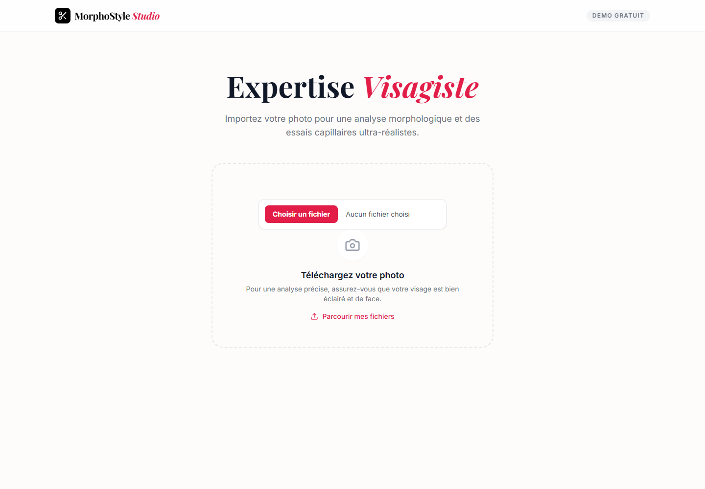

# MorphoStyle AI - Assistant de conseil coiffure et style par IA

## Rapport complet

Ce depot public presente le concept, les fonctions, les choix de conception, les outils utilises, les commandes locales et les captures d'ecran de l'application. Il est genere par l'orchestrateur uniquement apres validation de publication publique.

## Concept

Application web qui analyse une photo de visage et propose des styles de coiffure ou barbe adaptés à la morphologie, avec génération d'aperçus réalistes et angles supplémentaires.

Démocratiser l'accès à des conseils professionnels en coiffure et style en combinant analyse morphologique automatisée et génération d'images réalistes, pour fournir des recommandations personnalisées et immédiates.

Public vise: Professionnels de la coiffure, designers, utilisateurs souhaitant expérimenter des styles personnalisés, et toute personne intéressée par des outils créatifs basés sur l'IA.


## Fonctionnement de l'application

L'application suit un workflow en cinq étapes : 1) L'utilisateur charge une photo de son visage et remplit un formulaire de profil (âge, type de visage, préférences). 2) L'IA analyse la morphologie du visage via un schéma JSON strict et génère des recommandations de styles adaptés. 3) L'utilisateur sélectionne jusqu'à quatre styles parmi les propositions générées. 4) L'IA génère des aperçus réalistes en conservant l'identité, la lumière, les vêtements et le contexte de la photo originale. 5) L'utilisateur peut demander des angles supplémentaires (profil gauche/droit, dos) pour une visualisation complète. Le système gère automatiquement les erreurs et les retries en cas de saturation du service.

## Fonctions de l'application

- Analyse morphologique automatique du visage à partir d'une photo
- Génération de recommandations de styles de coiffure ou barbe adaptés
- Création d'aperçus réalistes en conservant l'identité, la lumière et le contexte de la photo originale
- Génération d'angles supplémentaires (profil gauche/droit, dos)
- Conservation automatique des vêtements, du fond et de l'éclairage
- Gestion des erreurs et retries automatiques en cas de saturation du service
- Validation stricte des âges pour éviter les suggestions inappropriées
- Création d'aperçus réalistes en conservant l'identité, la lumière et le contexte
- Génération d'angles supplémentaires (face, profil gauche/droit, dos)
- Gestion des erreurs et retries automatiques avec délai exponentiel
- Validation automatique des âges pour éviter les suggestions inappropriées
- Interface responsive adaptée aux mobiles et desktop

## Actualisations et evolution

- Optimisation des prompts pour une meilleure conservation de l'identité et du contexte dans les aperçus générés
- Ajout de la gestion automatique des retries avec délai exponentiel en cas de saturation du service d'IA
- Validation stricte des âges pour exclure les suggestions inappropriées (ex : barbe pour enfants)
- Amélioration de la robustesse des schémas JSON pour l'analyse morphologique
- Passage en statut PUBLIC_READY avec validation de sécurité OK_PUBLIC
- Statut courant: PUBLIC_READY.
- Securite: OK_PUBLIC.
- Fonctionnement: FONCTIONNEL.

## Comment le projet a ete reflechi et construit

Le projet a été conçu comme un assistant de consultation en coiffure, combinant analyse structuree, recommandations lisibles et génération d'images réalistes. Les choix clés incluent : l'utilisation d'un schéma JSON strict pour l'analyse morphologique afin d'assurer la précision des recommandations, des prompts optimisés pour conserver l'identité et le contexte de la photo dans les aperçus générés, une gestion automatique des retries avec délai exponentiel pour améliorer la robustesse, et une interface utilisateur intuitive pour faciliter l'expérience. L'architecture modulaire sépare clairement le frontend (React avec Vite) du backend (Node.js), avec une gestion centralisée des erreurs et des validations. Le responsive design permet une utilisation optimale sur mobile et desktop.

Cette section doit expliquer les choix qui ont guide le projet: besoin de depart, structure retenue, modules principaux, compromis techniques, interface ou logique metier, et raisons des outils utilises.

### Outils, IA et moteurs utilises

- React pour l'interface utilisateur
- Vite comme serveur de développement et outil de build
- Node.js pour le backend et la gestion des scripts
- @google/genai pour l'interaction avec les modèles d'IA
- Tailwind CSS pour le style et la mise en page
- TypeScript pour le typage statique
- ES Modules pour la gestion des dépendances
- Git pour le versionnage du code
- Architecture modulaire avec séparation frontend/backend
- Utilisation de schémas JSON stricts pour l'analyse morphologique
- Prompts optimisés pour la conservation de l'identité et du contexte
- Génération d'images réalistes via des modèles d'IA spécialisés
- Gestion des erreurs et retries automatiques avec délai exponentiel
- Responsive design pour une utilisation sur mobile et desktop
- TypeScript pour une meilleure maintenabilité et robustesse du code
- ES Modules pour une gestion moderne des dépendances

### Options techniques detectees

- Type de projet: node
- Gestionnaire: npm
- Nom package: morphostyle-ai
- Version: 1.0.0
- Lien public: https://morphostyle.c2rdesign.com
- Statut securite: OK_PUBLIC

### Stack et dependances principales

- Vite/Dev server
- React
- Node.js
- Architecture modulaire avec séparation frontend/backend
- Utilisation de schémas JSON stricts pour l'analyse morphologique
- Prompts optimisés pour la conservation de l'identité et du contexte
- Génération d'images réalistes via des modèles d'IA spécialisés
- Gestion des erreurs et retries automatiques avec délai exponentiel
- Responsive design pour une utilisation sur mobile et desktop
- TypeScript pour une meilleure maintenabilité et robustesse du code
- ES Modules pour une gestion moderne des dépendances

### Scripts disponibles

- build: tsc && vite build
- dev: vite
- dev:api: node server/index.mjs
- lint: tsc --noEmit
- preview: vite preview
- start: node server/index.mjs
- validate:recipes: node scripts/validate-preview-recipes.mjs

### Dependances applicatives

- @google/genai ^1.34.0
- lucide-react ^0.462.0
- react ^19.0.0
- react-dom ^19.0.0

### Dependances de developpement

- @types/node ^22.10.2
- @types/react ^19.0.0
- @types/react-dom ^19.0.0
- @vitejs/plugin-react ^6.0.2
- autoprefixer ^10.4.20
- postcss ^8.4.49
- tailwindcss ^3.4.16
- typescript ^5.7.2
- vite ^8.0.16

## Automatisations et comportements internes

- Analyse morphologique automatique via un schéma JSON strict
- Génération rapide de prévisualisations réalistes
- Génération des angles supplémentaires (face, profil gauche/droit, dos)
- Retries automatiques en cas de saturation du service avec délai exponentiel
- Validation automatique des âges pour éviter les suggestions inappropriées
- Conservation automatique de l'identité, de la lumière et du contexte dans les prompts

## Installation locale

[object Object]

### Pre-requis
- Node.js installe localement.
- Gestionnaire detecte: npm.
- Creer un fichier `.env` local a partir de `.env.example` si des variables sont necessaires.

### Commandes
```powershell
npm install
npm run build
npm run dev
npm run start
```

### Scripts utiles
- build: tsc && vite build
- dev: vite
- dev:api: node server/index.mjs
- lint: tsc --noEmit
- preview: vite preview
- start: node server/index.mjs
- validate:recipes: node scripts/validate-preview-recipes.mjs

## Lancement

```powershell
npm run dev
npm run start
npm run build
```

## Utilisation

Après installation, l'utilisateur accède à l'application via un navigateur web. Il commence par charger une photo de son visage, puis remplit un formulaire de profil (âge, type de visage, préférences). L'application analyse automatiquement la morphologie et propose des styles adaptés. L'utilisateur sélectionne jusqu'à quatre styles, puis l'IA génère des aperçus réalistes en conservant ses caractéristiques uniques. Il peut ensuite demander des angles supplémentaires (profil gauche/droit, dos) pour une visualisation complète. Le système gère automatiquement les erreurs et les retries en cas de saturation du service.

## Captures d'ecran




## Variables d'environnement

Copier `.env.example` vers `.env` en local puis remplir les valeurs privees.

## Securite

Ne jamais publier `.env`, tokens, sessions, logs sensibles, cles privees ou donnees personnelles.
