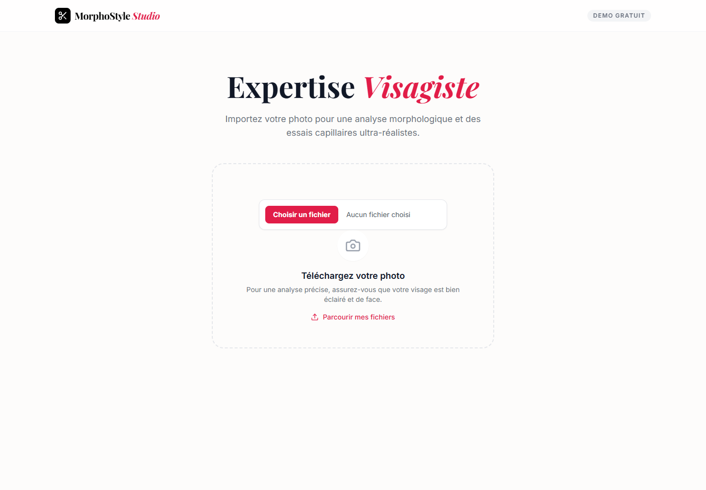
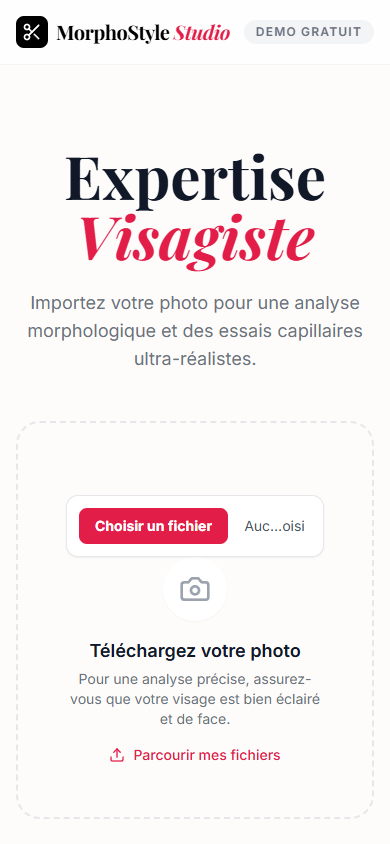

# MorphoStyle AI - Assistant de conseil coiffure et style par IA

## Presentation

MorphoStyle AI - Assistant de conseil coiffure et style par IA est presente ici avec son concept, ses fonctions, ses choix de conception et ses informations d'utilisation.

## Mode actuel

- Profils demo: base statique preparee et decoupee localement.
- Photo personnelle: OpenAI Image cote serveur.
- Quota utilisateur: 1 essai complet par jour.
- Cout API controle: 1 planche 4x4 pour les 4 recommandations, puis 1 planche finale pour la coupe selectionnee.
- Les cles API restent cote serveur et ne sont jamais exposees dans le navigateur.
- Memoire projet: `docs/memoire/`.
- Ajout multi-utilisateur Hostinger a cadrer: `docs/architecture/AJOUT_MULTI_UTILISATEUR_HOSTINGER.md`.

## Demarrage rapide

### Pre-requis

- Git installe localement.
- Node.js 20 ou plus recent.
- Gestionnaire de paquets: npm.

### Installer et lancer

```powershell
git clone https://github.com/RYJITS/morphostyle.git
cd morphostyle
npm install
npm run dev
```

## Installation locale

### Pre-requis
- Node.js installe localement.
- Gestionnaire detecte: npm.
- Creer un fichier `.env` local a partir de `.env.example` si des variables sont necessaires.

### Commandes
```powershell
git clone https://github.com/RYJITS/morphostyle.git
cd morphostyle
npm install
```

## Lancement

```powershell
npm run dev
npm run start
npm run build
```

## Utilisation

Après installation, l'utilisateur accède à l'application via un navigateur web. Il peut sélectionner un profil demo statique ou charger sa propre photo. Pour une photo personnelle, il remplit les réglages de consultation, utilise son essai OpenAI du jour, reçoit 4 propositions issues d'une planche 4x4, puis choisit une proposition pour générer la planche finale avec vue de face, profil gauche, profil droit et dos.

## Concept

Application web de consultation visagiste qui propose des profils demo statiques et un essai photo personnelle via OpenAI Image, limite a un essai complet par jour.

Démocratiser l'accès à des conseils professionnels en coiffure et style en combinant analyse morphologique automatisée et génération d'images réalistes, pour fournir des recommandations personnalisées et immédiates.

Public vise: Professionnels de la coiffure, designers, utilisateurs souhaitant expérimenter des styles personnalisés, et toute personne intéressée par des outils créatifs basés sur l'IA.


## Fonctionnement de l'application

L'application suit deux parcours. Les profils demo chargent des planches statiques deja preparees. Pour une photo personnelle, l'utilisateur charge son portrait, choisit ses reglages, puis OpenAI genere une premiere planche 4x4 avec quatre propositions. L'utilisateur selectionne une proposition et une seconde planche finale est generee puis decoupee en face, profil gauche, profil droit et dos. Le serveur applique une limite d'un essai complet OpenAI par jour.

## Fonctions de l'application

- Selection de profils demo statiques
- Upload d'une photo personnelle
- Generation OpenAI d'une planche 4x4 de recommandations
- Generation OpenAI d'une planche finale pour la coupe selectionnee
- Quota serveur: un essai complet photo personnelle par jour
- Decoupage local des planches en portraits face, profils et dos
- Conservation automatique des vêtements, du fond et de l'éclairage
- Gestion des erreurs et retries automatiques en cas de saturation du service
- Validation stricte des âges pour éviter les suggestions inappropriées

## Actualisations et evolution

- Optimisation des prompts pour une meilleure conservation de l'identité et du contexte dans les aperçus générés
- Ajout de la gestion automatique des retries avec délai exponentiel en cas de saturation du service d'IA
- Validation stricte des âges pour exclure les suggestions inappropriées (ex : barbe pour enfants)
- Amélioration de la robustesse des schémas JSON pour l'analyse morphologique
- Ajout du mode OpenAI Image avec quota d'un essai complet par jour
- Passage du parcours photo personnelle a deux planches: recommandations puis resultat final

## Comment le projet a ete reflechi et construit

Le projet a été conçu comme un assistant de consultation en coiffure, combinant analyse structuree, recommandations lisibles et génération d'images réalistes. Les choix clés incluent : l'utilisation d'un schéma JSON strict pour l'analyse morphologique afin d'assurer la précision des recommandations, des prompts optimisés pour conserver l'identité et le contexte de la photo dans les aperçus générés, une gestion automatique des retries avec délai exponentiel pour améliorer la robustesse, et une interface utilisateur intuitive pour faciliter l'expérience. L'architecture modulaire sépare clairement le frontend (React avec Vite) du backend (Node.js), avec une gestion centralisée des erreurs et des validations. Le responsive design permet une utilisation optimale sur mobile et desktop.

### Outils, IA et moteurs utilises

- React pour l'interface utilisateur
- Vite comme serveur de développement et outil de build
- Node.js pour le backend et la gestion des scripts
- OpenAI Image API cote serveur pour les essais photo personnelle
- @google/genai conserve pour les anciens modes/fallbacks
- Tailwind CSS pour le style et la mise en page
- TypeScript pour le typage statique
- ES Modules pour la gestion des dépendances
- Sharp cote serveur pour decouper les planches generees
- Quota journalier serveur avec sessions de generation
- Git pour le versionnage du code
- Architecture modulaire avec séparation frontend/backend
- Utilisation de schémas JSON stricts pour l'analyse morphologique
- Prompts optimisés pour la conservation de l'identité et du contexte
- Génération d'images réalistes via des modèles d'IA spécialisés
- Gestion des erreurs et retries automatiques avec délai exponentiel
- Responsive design pour une utilisation sur mobile et desktop
- TypeScript pour une meilleure maintenabilité et robustesse du code
- ES Modules pour une gestion moderne des dépendances

### Options techniques detectees

- Type de projet: node
- Gestionnaire: npm
- Nom package: morphostyle-ai
- Version: 1.0.0
- Lien public: https://morphostyle.c2rdesign.com

### Stack et dependances principales

- Vite/Dev server
- React
- Node.js
- Architecture modulaire avec séparation frontend/backend
- Utilisation de schémas JSON stricts pour l'analyse morphologique
- Prompts optimisés pour la conservation de l'identité et du contexte
- Génération d'images réalistes via des modèles d'IA spécialisés
- Gestion des erreurs et retries automatiques avec délai exponentiel
- Responsive design pour une utilisation sur mobile et desktop
- TypeScript pour une meilleure maintenabilité et robustesse du code
- ES Modules pour une gestion moderne des dépendances

### Scripts disponibles

- build: tsc && vite build
- dev: vite
- dev:api: node server/index.mjs
- lint: tsc --noEmit
- preview: vite preview
- start: node server/index.mjs
- validate:recipes: node scripts/validate-preview-recipes.mjs

### Dependances applicatives

- @google/genai ^1.34.0
- lucide-react ^0.462.0
- react ^19.0.0
- react-dom ^19.0.0

### Dependances de developpement

- @types/node ^22.10.2
- @types/react ^19.0.0
- @types/react-dom ^19.0.0
- @vitejs/plugin-react ^6.0.2
- autoprefixer ^10.4.20
- postcss ^8.4.49
- tailwindcss ^3.4.16
- typescript ^5.7.2
- vite ^8.0.16

## Automatisations et comportements internes

- Generation OpenAI limitee a un essai complet par jour
- Creation d'une session entre la planche recommandations et la planche finale
- Decoupage automatique des planches avec Sharp
- Blocage du deuxieme essai journalier cote serveur
- Validation automatique des âges pour éviter les suggestions inappropriées
- Conservation automatique de l'identité, de la lumière et du contexte dans les prompts

## Captures d'ecran





## Variables d'environnement

Copier `.env.example` vers `.env` en local puis remplir les valeurs privees.

Variables principales:

- `OPENAI_API_KEY`
- `OPENAI_IMAGE_MODEL`
- `OPENAI_IMAGE_QUALITY`
- `OPENAI_DAILY_TRIAL_LIMIT`
- `OPENAI_QUOTA_TIME_ZONE`

## Securite

Ne jamais publier `.env`, tokens, sessions, logs sensibles, cles privees ou donnees personnelles.
